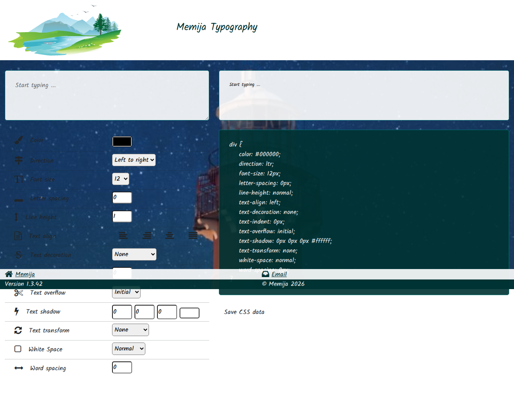

# 📝 Memija Typography

Typography application built with React and Webpack.

[](https://sonarcloud.io/dashboard?id=Memija_memija-typography)

## 🌟 What is Memija Typography?

Memija Typography is a web application that allows you to easily preview and configure CSS typography settings. You can type in some text, and then use the interactive controls to adjust properties like:

- 🎨 Color
- ↔️ Direction (LTR/RTL)
- 🔠 Font size
- 📏 Letter spacing
- ↕️ Line height
- 📑 Text alignment
- 〰️ Text decoration
- ...and many more!

As you make changes, the application instantly generates the corresponding CSS code for your configured styles, which you can easily save or copy.

### 📸 Application Preview

Here is a look at what the application does:



## 🛠️ Prerequisites

- 🟢 Node.js (v14 or higher recommended)
- 📦 npm

## 💻 Development

Install dependencies:

```bash
npm install
```

Start development server (webpack-dev-server):

```bash
npm run open
```

Lint code:

```bash
npm run lint
```

Run tests:

```bash
npm test
```

## 🏗️ Production Build

Build the application for production:

```bash
npm run build
```

The output will be in the `dist/` directory.

## 🚀 Deployment

This application is deployed on GitHub Pages. You can use the `gh-pages` package to deploy the application, by using the output in the `dist/` directory.
